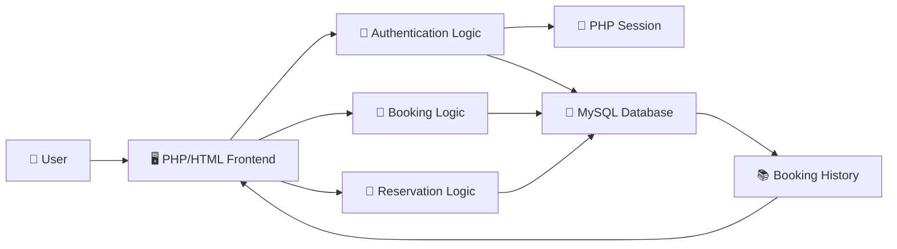
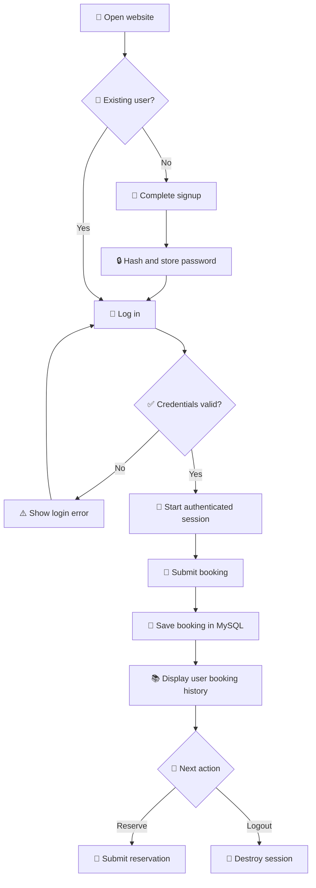

# 🚕 India Taxi Booking Website

A full-stack taxi-booking website built with PHP, MySQL, HTML, CSS, and vanilla JavaScript. The application allows visitors to explore destinations, create an account, log in, book or reserve a taxi, and review their booking history.

## 📖 Overview

India Taxi Booking Website demonstrates a traditional server-rendered web application with user authentication, session-based access control, booking persistence, reservation management, and a destination-focused frontend.

The project is designed for a local PHP/MySQL environment such as XAMPP, WAMP, or LAMP. It includes database scripts for user accounts, booking history, and taxi reservations.

## ✨ Features

- 🏠 Destination-focused landing page
- 🚖 Taxi booking with pickup and drop locations
- 📅 Date and time selection for rides
- 📝 Separate taxi-reservation form
- 👤 New-user registration
- 🔐 Password hashing with PHP's `password_hash()`
- 🔑 Login verification with `password_verify()`
- 🍪 Session-based authentication
- 📚 User-specific booking history
- 🚪 Secure session logout
- 🖼️ Automated image slideshow
- 🏛️ Tourism and destination gallery
- ❓ Frequently asked questions section
- 📱 Responsive form and card layouts

## 🧰 Tech Stack

| Technology | Purpose |
| --- | --- |
| 🐘 PHP | Handles authentication, sessions, booking logic, reservations, and redirects |
| 🐬 MySQL | Stores users, bookings, and reservations |
| 🌐 HTML5 | Defines pages, forms, navigation, tables, and content |
| 🎨 CSS3 | Provides layouts, colors, forms, animation, and responsive presentation |
| ⚙️ JavaScript | Controls the slideshow, signup navigation, alerts, and client interactions |
| 🗄️ phpMyAdmin SQL exports | Provide the initial database schemas and sample records |

## 🌟 Project Highlights

- **Complete booking journey:** Supports registration, login, booking, history, and logout.
- **Protected booking data:** Booking history requires an authenticated session.
- **Secure password storage:** Account passwords are hashed instead of stored as plain text.
- **User-specific history:** Bookings are filtered using the logged-in user's email address.
- **Multiple ride flows:** Users can make a direct booking or submit a separate reservation.
- **Server-rendered implementation:** PHP and HTML work together without a frontend framework.
- **Tourism-oriented design:** Destination photography and a rotating moments gallery enrich the landing page.

## 🏗️ System Architecture

The application follows a classic three-layer web architecture. Browser requests are handled by PHP pages, which perform application logic and exchange data with a MySQL database.



### 🧩 Main Components

| Component | Responsibility |
| --- | --- |
| 🏠 `frontend/index.php` | Renders the landing page, booking form, signup form, gallery, and FAQs |
| 👤 `backend/backendsignup.php` | Validates registration, hashes passwords, and creates users |
| 🔑 `backend/login.php` | Verifies credentials and initializes the user session |
| 🚕 `backend/booking_data.php` | Protects booking access, stores rides, and displays user history |
| 📝 `backend/reservation.php` | Collects and stores reservation details |
| 🚪 `backend/logout.php` | Clears and destroys the active session |
| ↪️ `main.php` | Redirects visitors to the frontend landing page |
| 🗄️ SQL files | Define the `sign`, `booking_history`, and `reservation` tables |

## 🔄 Application Workflow



### 🪜 Step-by-Step Flow

1. `main.php` redirects the visitor to the landing page.
2. A new visitor completes the signup form.
3. PHP validates matching passwords, hashes the password, and stores the account.
4. The user logs in with an email address and password.
5. PHP verifies the password and stores the user's name and email in the session.
6. The authenticated user submits phone, pickup, drop, and travel-time details.
7. The booking is stored in `booking_history` and displayed in reverse chronological order.
8. The user can also submit a separate taxi reservation.
9. Logout removes session variables and returns the user to the login page.

## 🗃️ Database Design

### 👤 `sign` Table

Stores account information including name, address, contact number, email address, and hashed password.

### 🚕 `booking_history` Table

Stores authenticated bookings with user details, phone number, pickup, destination, travel time, and creation timestamp.

### 📝 `reservation` Table

Stores standalone reservation details including customer name, phone number, pickup, destination, date, and time.

## 📁 Project Structure

```text
taxi_booking_website-main/
├── backend/
│   ├── backendsignup.php     # Registration and password hashing
│   ├── booking_data.php      # Booking storage and user history
│   ├── login.php             # Authentication and session creation
│   ├── logout.php            # Session termination
│   └── reservation.php       # Taxi reservation form and storage
├── frontend/
│   ├── index.php             # Landing page and primary forms
│   ├── *.webp / *.avif       # Destination and slideshow images
│   └── taxi PNG asset        # Main vehicle graphic
├── booking_history.sql       # Booking-history schema and sample data
├── reservation.sql           # Reservation schema and sample data
├── sign.sql                  # User-account schema and sample data
├── main.php                  # Application entry-point redirect
└── README.md                 # Project documentation
```

## 🚀 Getting Started

### ✅ Prerequisites

- PHP 8 or later
- MySQL 8 or compatible MariaDB version
- Apache or another PHP-capable web server
- phpMyAdmin or the MySQL command-line client
- A modern web browser

XAMPP is a convenient all-in-one option for local development.

### 📥 Installation

1. Extract the project into your web server's document root—for example, `htdocs` when using XAMPP.
2. Start Apache and MySQL.
3. Open phpMyAdmin at `http://localhost/phpmyadmin`.
4. Create a database named `sign_up`.
5. Import the SQL files in this order:

```text
sign.sql
booking_history.sql
reservation.sql
```

6. Update every database connection to match your local environment:

```php
$con = mysqli_connect('localhost', 'YOUR_DB_USER', 'YOUR_DB_PASSWORD', 'sign_up');
```

7. Open the application:

```text
http://localhost/taxi_booking_website-main/main.php
```

### 🖼️ Asset Setup

The current `frontend/index.php` references images inside an `asset/` directory, while the provided archive stores the image files directly inside `frontend/`. Choose one consistent approach:

- Create `frontend/asset/` and move the image files into it; or
- Update the image `src` attributes to reference files directly from `frontend/`.

The page also references `frontend/style.css`, but that stylesheet is not included in the archive. Add the missing stylesheet or move the required CSS into `index.php` before expecting the landing page to render correctly.

## 🎯 Usage

1. Open the application landing page.
2. Select **Sign up** and create a user account.
3. Log in with the registered email address and password.
4. Enter the phone number, pickup location, destination, and travel time.
5. Submit the taxi booking.
6. Review previous rides in the booking-history table.
7. Use **Reserve Now** for the separate reservation flow.
8. Select **Logout** when finished.

## 📸 Screenshots

### 🏠 Landing Page


### 🔑 Login Page


### 🚕 Booking and History


> Create a `screenshots` folder and save the images with the filenames shown above to display them here.

## 🔐 Security Considerations

- Remove hardcoded database usernames and passwords from source files. Load them from environment variables or a protected configuration file.
- Replace interpolated SQL queries with prepared statements to prevent SQL injection.
- Add CSRF tokens to signup, login, booking, reservation, and logout forms.
- Regenerate the PHP session identifier after successful login.
- Configure secure, HTTP-only, and same-site session cookies.
- Validate and normalize all server-side form input.
- Do not display raw database errors in production.
- Add rate limiting and temporary lockout protection to authentication.
- Enforce a unique index on user email addresses.
- Require HTTPS in a production deployment.

## ⚠️ Important Repository Notes

- The database credentials are currently embedded directly in PHP files and must be changed before use.
- The SQL exports contain sample names, email addresses, phone numbers, bookings, and password hashes. Remove personal or test data before publishing the repository.
- `frontend/style.css` is referenced but missing from the archive.
- Image paths in `frontend/index.php` expect an `asset/` folder that is absent from the archive.
- Some SQL queries escape only selected fields or do not escape input at all.
- The standalone reservation flow is not protected by login authentication.
- The booking page contains a commented-out booking form while still displaying history.

## ♿ Accessibility Considerations

- Add descriptive alternative text to every destination and slideshow image.
- Associate every form field with a visible `<label>`.
- Provide keyboard-visible focus styles for links, buttons, and form controls.
- Replace JavaScript alert dialogs with inline status messages.
- Ensure navigation and slideshow controls are accessible to keyboard and screen-reader users.
- Verify color contrast throughout the landing, login, booking, and reservation pages.

## 🔮 Future Improvements

- 📍 Add interactive maps and pickup-location suggestions
- 💰 Estimate fares before booking confirmation
- 🚘 Support multiple vehicle categories
- 💳 Integrate secure online payments
- 📧 Send booking confirmation by email or SMS
- ❌ Add booking cancellation and rescheduling
- 👨‍✈️ Create driver assignment and driver-management tools
- 🛠️ Add an administrative dashboard
- 📊 Show booking statistics and service analytics
- 🗺️ Track active rides in real time
- 🔔 Add status notifications for passengers
- 🧪 Introduce automated PHP, database, and browser tests
- 🧱 Separate presentation, business logic, and data access into reusable layers

## 🙏 Acknowledgements

- Built with PHP, MySQL, and standard frontend web technologies.
- Destination and taxi graphics are included as local project assets.
- Thanks to the PHP, MySQL, and web-development communities for their documentation and educational resources.

## 👨‍💻 Author

**Ravi Kumar Sharma**

Created as a full-stack web-development project demonstrating authentication, sessions, relational data storage, booking workflows, server-rendered pages, and frontend interactions.

## 📄 License

This project is intended for educational and personal use. Verify that all image assets are licensed appropriately and add a `LICENSE` file before public redistribution.

